<p align="center">
  
</p>

<p align="center">
  <a href="https://git.io/typing-svg">
    
  </a>
</p>

<p align="center">
  <a href="https://opensec.in/"></a>
  <a href="https://github.com/Kushalkhemka"></a>
  <a href="https://www.linkedin.com/in/kushalkh/"></a>
  <a href="https://leetcode.com/u/kushalkhemka/"></a>
  <a href="https://tryhackme.com/p/kushalkhemka"></a>
</p>

<p align="center">
  
</p>

## Mission

I build systems where AI agents reason over code, security evidence, and market-scale repositories. My current center of gravity is **OpenSec**, an AI-native OSS security platform for repository-scale vulnerability detection, triage, remediation, and secure code intelligence.

<table>
  <tr>
    <td width="25%"><b>Primary lane</b><br />AI security agents</td>
    <td width="25%"><b>Building</b><br />OpenSec, AEGIS, TRACEVUL</td>
    <td width="25%"><b>Research</b><br />Adversarial ML at DRDO</td>
    <td width="25%"><b>Base</b><br />Delhi, India</td>
  </tr>
</table>

## OpenSec Intelligence

<table>
  <tr>
    <td width="55%">
      <h3>OpenSec</h3>
      <p><b>From vulnerability to visibility.</b> We scan, triage, and remediate vulnerabilities in open-source repositories with AI-powered code intelligence.</p>
      <p><a href="https://opensec.in/">opensec.in</a> | <a href="https://github.com/Kushalkhemka/opensec">GitHub repo</a></p>
    </td>
    <td width="45%">
      
    </td>
  </tr>
</table>

| System | What it does |
| --- | --- |
| **AEGIS** | Repository-scale vulnerability detection and remediation using SAST signals, RAG code retrieval, program-flow reasoning, exploitability analysis, multi-agent triage, and automated patch generation. |
| **TRACEVUL** | Context-resolved vulnerability corpus with 94,759 canonical records, 184K training samples, 19+ languages, 553 CWEs, and 6,192 OSS repositories. |
| **Reasoning LLM** | In-house Qwen 3.6 27B vulnerability reasoning model fine-tuned with RsLoRA SFT for detection-to-remediation workflows. |
| **Security research** | 28 zero-day vulnerability candidates across 6 OSS repositories, including credited discovery of CVE-2026-42766 in OpenSSL, with accepted fixes in OpenSSL and Vim. |
| **Grant** | INR 38 lakh Government of India grant for AI-native vulnerability detection and automated remediation. |

## Build Map

<table>
  <tr>
    <td width="50%">
      <h3>Security Agents</h3>
      <p>SAST, SCA, DAST, CWE/CVE mapping, exploitability reasoning, validation, and patch workflows.</p>
    </td>
    <td width="50%">
      <h3>Applied ML</h3>
      <p>Computer vision, adversarial ML, retrieval systems, embeddings, U-Net nowcasting, and LLM pipelines.</p>
    </td>
  </tr>
  <tr>
    <td width="50%">
      <h3>Backend Systems</h3>
      <p>FastAPI, Flask, PostgreSQL, MongoDB, Redis, Docker, Linux, AWS, GCP, and production API surfaces.</p>
    </td>
    <td width="50%">
      <h3>Problem Solving</h3>
      <p>C++ DSA practice, efficient solution patterns, and maintainable implementations in public repositories.</p>
    </td>
  </tr>
</table>

## Featured Work

<table>
  <tr>
    <td width="50%">
      <h3>AEGIS</h3>
      <p>Agentic vulnerability detection, triage, exploitability reasoning, and patch generation for OSS repositories.</p>
      <p><a href="https://opensec.in/">OpenSec</a></p>
    </td>
    <td width="50%">
      <h3>TRACEVUL</h3>
      <p>Training and evaluation corpus linking CVEs to vulnerable regions, fix states, patch evidence, call graphs, root causes, and validation metadata.</p>
    </td>
  </tr>
  <tr>
    <td width="50%">
      <h3>CloudChase</h3>
      <p>U-Net based cloud coverage prediction using multi-spectral INSAT-3DS imagery, physics-aware losses, SSIM, PSNR, and nowcasting workflows.</p>
      <p><a href="https://github.com/mayank-jangid-moon/CloudChase">Repository</a></p>
    </td>
    <td width="50%">
      <h3>TxnGuard</h3>
      <p>Secure banking, autonomous fraud detection, and AML multi-agent framework using vectorized transaction evidence and CrewAI triage.</p>
    </td>
  </tr>
  <tr>
    <td width="50%">
      <h3>Virtual Try-On</h3>
      <p>Pose-guided try-on with OpenPose, SCW-VTON style warping, skin-tone analysis, and visual retrieval over 7K+ catalog items.</p>
      <p><a href="https://github.com/Kushalkhemka/fashion-vton">Repository</a></p>
    </td>
    <td width="50%">
      <h3>LeetCode</h3>
      <p>C++ solution repository focused on efficient approaches, pattern recognition, and clean implementation notes.</p>
      <p><a href="https://github.com/Kushalkhemka/leetcode">Repository</a></p>
    </td>
  </tr>
</table>

## Stack

<p align="center">
  
</p>

```txt
languages      Python, C++, C, Java, JavaScript, TypeScript, SQL, Bash
ai/ml          PyTorch, TensorFlow, Hugging Face, scikit-learn, OpenCV, LangChain, RAG, AI agents
security       SAST, SCA, DAST, Burp Suite, Ghidra, IDA, Splunk, Semgrep, CWE/CVE analysis
backend/cloud  FastAPI, Flask, Docker, PostgreSQL, MongoDB, Redis, Linux, AWS, GCP
```

## Proof

<table>
  <tr>
    <td width="50%"><b>National Winner</b><br />Bhartiya Antariksh Hackathon 2025 by ISRO</td>
    <td width="50%"><b>National Winner</b><br />NCIIPC Startup India AI Grand Challenge Stages 1 and 2 by NTRO, Government of India</td>
  </tr>
  <tr>
    <td width="50%"><b>Winner</b><br />Coding Hackathon at APOGEE'25 by BITS Pilani</td>
    <td width="50%"><b>Winner</b><br />VisionX Hackathon at INVICTUS'25 by Delhi Technological University</td>
  </tr>
  <tr>
    <td width="50%"><b>Research</b><br />AI Research Intern at DRDO working on transfer-based black-box adversarial attacks for face verification systems</td>
    <td width="50%"><b>Leadership</b><br />Research Head at AIMS-DTU, Artificial Intelligence and Machine Learning Society</td>
  </tr>
</table>

## Live Signals

<p align="center">
  
  
</p>

<p align="center">
  
  
</p>

<p align="center">
  
</p>

<p align="center">
  
</p>

<p align="center">
  <a href="https://leetcode.com/u/kushalkhemka/">
    
  </a>
  <a href="https://tryhackme.com/p/kushalkhemka">
    
  </a>
</p>

## Repository Cards

<p align="center">
  <a href="https://github.com/Kushalkhemka/opensec">
    
  </a>
  <a href="https://github.com/Kushalkhemka/leetcode">
    
  </a>
</p>

<p align="center">
  <a href="https://github.com/Kushalkhemka/dataset_pipelineV2">
    
  </a>
  <a href="https://github.com/Kushalkhemka/fashion-vton">
    
  </a>
</p>

## Contribution Trace

<p align="center">
  <picture>
    <source media="(prefers-color-scheme: dark)" srcset="https://raw.githubusercontent.com/Kushalkhemka/Kushalkhemka/output/github-contribution-grid-snake-dark.svg" />
    <source media="(prefers-color-scheme: light)" srcset="https://raw.githubusercontent.com/Kushalkhemka/Kushalkhemka/output/github-contribution-grid-snake.svg" />
    
  </picture>
</p>

## Connect

<p align="center">
  <a href="https://opensec.in/"></a>
  <a href="https://www.linkedin.com/in/kushalkh/"></a>
  <a href="https://leetcode.com/u/kushalkhemka/"></a>
  <a href="https://tryhackme.com/p/kushalkhemka"></a>
</p>

<p align="center">
  
</p>

<p align="center">
  
</p>
