<picture>
  <source media="(max-width: 600px)" srcset="assets/hero-mobile.svg">
  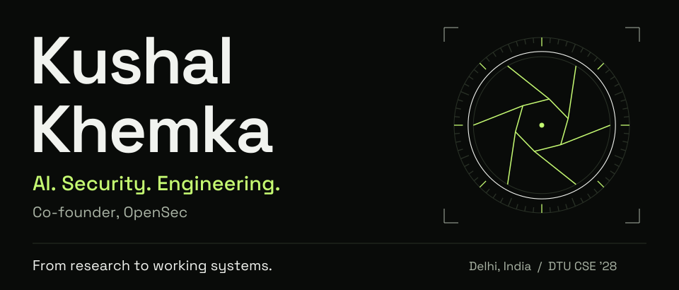
</picture>

  <a href="https://opensec.in/">OpenSec</a> &nbsp;·&nbsp;
  <a href="https://www.linkedin.com/in/kushalkh/">LinkedIn</a> &nbsp;·&nbsp;
  <a href="https://leetcode.com/u/kushalkhemka/">LeetCode</a> &nbsp;·&nbsp;
  <a href="https://tryhackme.com/p/kushalkhemka">TryHackMe</a>

I work across **AI, security, and software engineering** — from agents that reason over code to satellite nowcasting, fraud intelligence, and computer vision. I’m co-building **OpenSec** and bringing research into working systems.

## Selected work

<a href="https://opensec.in/">
  <picture>
    <source media="(max-width: 600px)" srcset="assets/opensec-mobile.svg">
    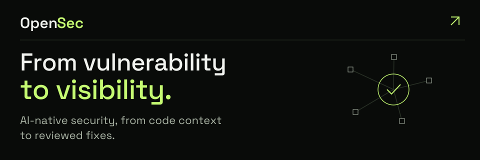
  </picture>
</a>

**AEGIS** connects repository-scale analysis, code retrieval, program-flow reasoning, and agentic triage to proposed patches. **TRACEVUL** links vulnerabilities to code, fixes, and validation evidence for training and evaluation.

<b>Inside OpenSec: research and intelligence</b>

- **AEGIS:** SAST signals, RAG code retrieval, program-flow reasoning, exploitability analysis, multi-agent triage, and automated patch generation.
- **TRACEVUL:** 94,759 canonical vulnerability records, 184K training samples, 19+ languages, 553 CWEs, and 6,192 OSS repositories. The corpus links CVEs to vulnerable regions, fix states, patch evidence, call graphs, root causes, and validation metadata.
- **Reasoning model:** In-house Qwen 3.6 27B vulnerability reasoning model, fine-tuned with RsLoRA SFT for detection-to-remediation workflows.
- **Security research:** 28 zero-day vulnerability candidates across 6 OSS repositories, including credited discovery of CVE-2026-42766 in OpenSSL, with accepted fixes in OpenSSL and Vim.
- **Support:** INR 38 lakh Government of India grant for AI-native vulnerability detection and automated remediation.

[Explore the platform →](https://opensec.in/)

 

<a href="https://github.com/mayank-jangid-moon/CloudChase">
  <picture>
    <source media="(max-width: 600px)" srcset="assets/cloudchase-mobile.svg">
    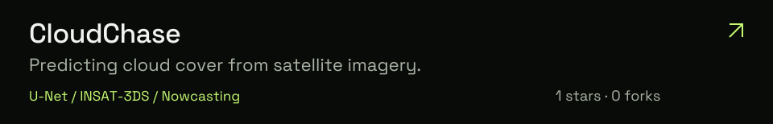
  </picture>
</a>

<a href="https://github.com/Kushalkhemka/txn-guard">
  <picture>
    <source media="(max-width: 600px)" srcset="assets/txnguard-mobile.svg">
    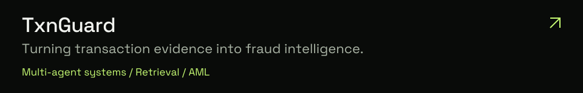
  </picture>
</a>

<a href="https://github.com/Kushalkhemka/fashion-vton">
  <picture>
    <source media="(max-width: 600px)" srcset="assets/vton-mobile.svg">
    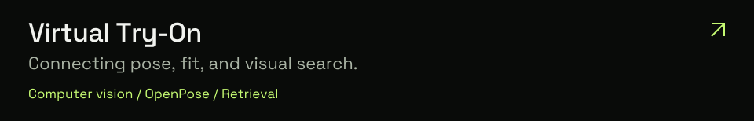
  </picture>
</a>

<a href="https://github.com/Kushalkhemka/leetcode">
  <picture>
    <source media="(max-width: 600px)" srcset="assets/leetcode-mobile.svg">
    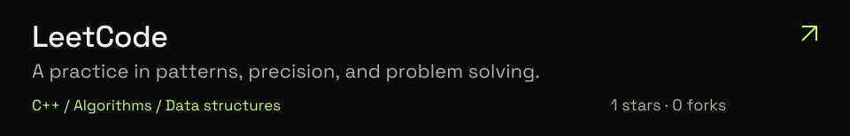
  </picture>
</a>

<a href="https://github.com/Kushalkhemka/dataset_pipelineV2">
<picture>
  <source media="(max-width: 600px)" srcset="assets/dataset-mobile.svg">
  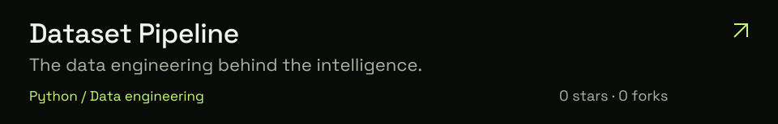
</picture>
</a>

<b>Project notes and more code</b>

- **[CloudChase](https://github.com/mayank-jangid-moon/CloudChase):** U-Net cloud coverage prediction using multi-spectral INSAT-3DS imagery, physics-aware losses, SSIM, PSNR, and nowcasting workflows.
- **[TxnGuard](https://github.com/Kushalkhemka/txn-guard):** Secure banking, autonomous fraud detection, and an AML multi-agent framework using vectorized transaction evidence and CrewAI triage.
- **[Virtual Try-On](https://github.com/Kushalkhemka/fashion-vton):** Pose-guided try-on with OpenPose, SCW-VTON style warping, skin-tone analysis, and visual retrieval over 7K+ catalog items.
- **[LeetCode](https://github.com/Kushalkhemka/leetcode):** C++ solutions focused on efficient approaches, pattern recognition, and clean implementation notes.
- **[Dataset pipeline](https://github.com/Kushalkhemka/dataset_pipelineV2):** More of my data engineering work.

## Achievements & research

-  **National Winner · ISRO** — Bhartiya Antariksh Hackathon 2025.
-  **National Winner · NCIIPC / NTRO** — Startup India AI Grand Challenge, Stages 1 and 2.
-  **Winner · BITS Pilani** — Coding Hackathon at APOGEE’25.
-  **Winner · DTU** — VisionX Hackathon at INVICTUS’25.
-  **AI Research Intern · DRDO** — Transfer-based black-box adversarial ML for face verification systems.
-  **Research Head · AIMS-DTU** — Artificial Intelligence and Machine Learning Society.

[GitHub achievements →](https://github.com/Kushalkhemka?tab=achievements)

## GitHub activity

<a href="https://github.com/Kushalkhemka?tab=repositories">
<picture>
  <source media="(max-width: 600px)" srcset="assets/github-stats-mobile.svg">
  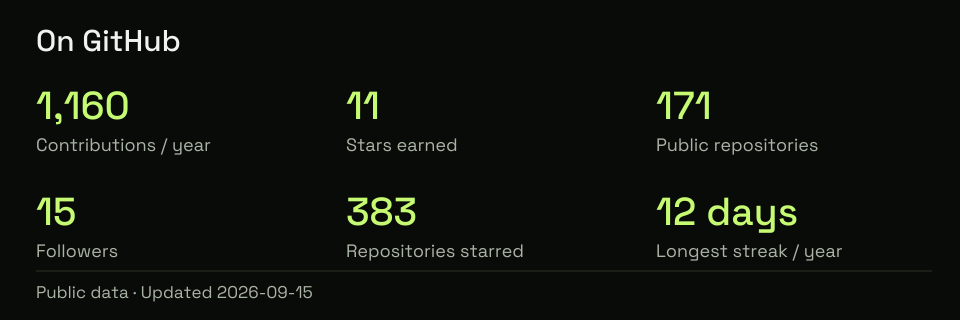
</picture>
</a>

<a href="https://github.com/Kushalkhemka?tab=overview">
<picture>
  <source media="(max-width: 600px)" srcset="assets/contributions-mobile.svg">
  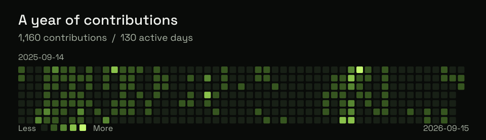
</picture>
</a>

Stats refresh daily. **Stars earned** counts stars on my public, non-fork repositories; **repositories starred** counts projects I have starred. Contributions follow GitHub’s public calendar. [View the dated data snapshot](assets/github-data.json) · [Refresh status](https://github.com/Kushalkhemka/Kushalkhemka/actions/workflows/refresh-profile.yml)

## Tools of the trade

**AI & ML**

  
  
  
  

**Languages**

  
  
  
  
  
  
  

**Frameworks & data**

  
  
  
  
  
  
  
  

**Cloud & developer tools**

  
  
  
  
  
  
  

**AI & ML** &nbsp; PyTorch · TensorFlow · Hugging Face · OpenCV · scikit-learn · LangChain · RAG

**Systems** &nbsp; Python · C++ · FastAPI · Flask · PostgreSQL · MongoDB · Redis · Docker · Linux

**Web & cloud** &nbsp; TypeScript · JavaScript · React · Next.js · Node.js · AWS · GCP

**Security** &nbsp; SAST · SCA · DAST · Semgrep · Burp Suite · Ghidra · IDA · CWE/CVE

Full toolkit

**Languages:** Python, C++, C, Java, JavaScript, TypeScript, SQL, Bash. 
**AI & ML:** PyTorch, TensorFlow, Hugging Face, OpenCV, scikit-learn, LangChain, retrieval systems, embeddings, and LLM pipelines. 
**Backend & infrastructure:** FastAPI, Flask, Node.js, PostgreSQL, MongoDB, Redis, Docker, Linux, AWS, GCP. 
**Frontend:** React, Next.js. 
**Security & developer tools:** SAST, SCA, DAST, Burp Suite, Ghidra, IDA, Semgrep, CWE/CVE mapping, Git, GitHub, Postman.

<a href="https://github.com/Kushalkhemka?tab=repositories">
<picture>
  <source media="(max-width: 600px)" srcset="assets/languages-mobile.svg">
  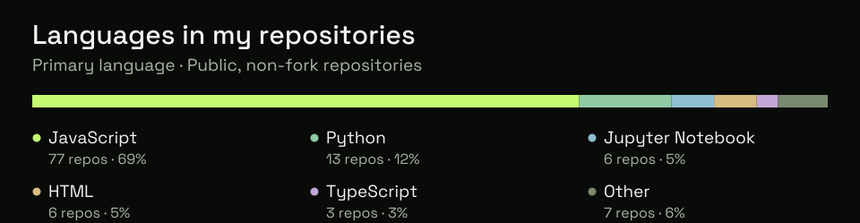
</picture>
</a>

 

<a href="https://www.linkedin.com/in/kushalkh/">
  <picture>
    <source media="(max-width: 600px)" srcset="assets/connect-mobile.svg">
    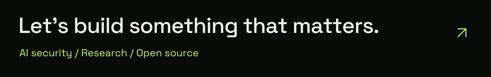
  </picture>
</a>

  <a href="https://www.linkedin.com/in/kushalkh/">Connect on LinkedIn</a> &nbsp;·&nbsp;
  <a href="https://opensec.in/">Explore OpenSec</a>

  

